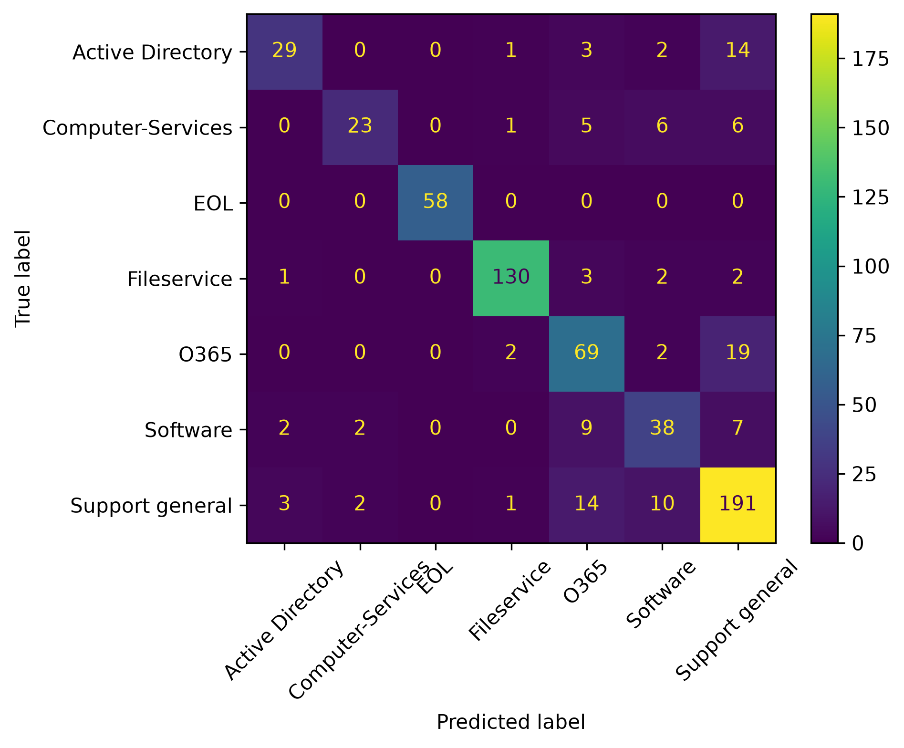

# Support Ticket Classifier

A machine learning project for automatically classifying IT support tickets into the appropriate support category based on their text.

## Overview

IT support systems receive tickets related to different services such as file access, email, software, printers, and user accounts. Manually routing these tickets to the appropriate category can take time, especially when the number of requests increases.

This project explores a machine learning approach for automatically classifying support tickets based on their text.

I developed the classifier by experimenting with different text representations and machine learning approaches, including Bag of Words, TF-IDF, n-grams, Naive Bayes, and Logistic Regression. The final model was selected using a validation set and was evaluated once on a separate, untouched test set.

## Dataset

The dataset used in this project is the [Classification of IT Support Tickets dataset](https://zenodo.org/records/7384758).

It contains multilingual IT support ticket texts and their corresponding categories.

In this project:

- 1,572 samples were available for training and model development.
- 657 samples were kept separate for final testing.
- The tickets belong to 7 different categories.

The categories are:

- Active Directory
- Computer-Services
- EOL
- Fileservice
- O365
- Software
- Support general

The dataset files are not included in this repository. They can be downloaded from the source linked above and placed in the `data/` directory.

## Data Challenges

Several challenges were identified while exploring and modeling the dataset.

### Class Imbalance

The number of samples differs significantly between categories. Fileservice and Support general contain considerably more samples than categories such as Active Directory and Computer-Services.

Because of this imbalance, accuracy alone was not considered sufficient. Precision, recall, macro F1, and weighted F1 were also examined.

### Noisy and Repetitive Text

Many tickets contain repeated template terms such as:

`TICKET ID`, `support`, `received`, `name`, `company`, `location`, and `address`.

These terms occur frequently across different categories while providing little useful information for distinguishing between them.

A custom stop-word list was therefore used to remove some of these dataset-specific terms.

### Overlapping Categories

Error analysis showed that some categories have significant semantic overlap.

A noticeable example was the overlap between **O365** and **Support general**. Tickets involving email access, shared mailboxes, email forwarding, quarantine, and similar operations could appear in either category.

This means that in some cases the ticket text alone may not contain enough information to clearly distinguish the correct category.

### Multilingual Text

The dataset contains tickets written in multiple languages. Similar technical problems can therefore be described using different vocabulary, which makes text classification more challenging.

## Approach

The project was developed iteratively rather than training only a single model.

The general workflow was:

1. Inspect the dataset and class distribution.
2. Create a training/validation split while keeping the provided test set untouched.
3. Build an initial Bag-of-Words + Naive Bayes baseline.
4. Analyze important terms and classification errors.
5. Remove repetitive dataset-specific terms.
6. Experiment with unigram and bigram features.
7. Replace simple count features with TF-IDF.
8. Compare Naive Bayes with Logistic Regression.
9. Address class imbalance using class-weighted Logistic Regression.
10. Compare different regularization strengths on the validation set.
11. Select the final configuration.
12. Retrain the selected pipeline using all available training data.
13. Evaluate the final model once on the untouched test set.

## Final Model

The selected model uses:

- **Text representation:** TF-IDF
- **N-grams:** Unigrams + Bigrams
- **Classifier:** Logistic Regression
- **Class weighting:** Balanced
- **C:** 10

The preprocessing and classifier are combined using a Scikit-learn `Pipeline`.

This allows raw ticket text to be passed directly to the model for prediction while ensuring that the same TF-IDF transformation used during training is also applied during inference.

## Experiments

Several configurations were compared during development.

The complete experiment results are available in:

`results/experiments.csv`

The experiments included different combinations of:

- Bag of Words
- TF-IDF
- Unigrams and bigrams
- Multinomial Naive Bayes
- Logistic Regression
- Class balancing
- Different regularization strengths

Model selection was performed using the validation set rather than the final test set.

## Final Results

After model selection, the final pipeline was retrained using all 1,572 available training samples and evaluated on the untouched test set of 657 tickets.

| Metric | Score |
|---|---:|
| Accuracy | **0.81** |
| Macro F1 | **0.77** |
| Weighted F1 | **0.81** |

### Per-Class Performance

| Category | Precision | Recall | F1 |
|---|---:|---:|---:|
| Active Directory | 0.65 | 0.57 | 0.61 |
| Computer-Services | 0.83 | 0.59 | 0.69 |
| EOL | 1.00 | 1.00 | 1.00 |
| Fileservice | 0.97 | 0.93 | 0.95 |
| O365 | 0.68 | 0.75 | 0.72 |
| Software | 0.63 | 0.59 | 0.61 |
| Support general | 0.79 | 0.86 | 0.82 |

Macro F1 was considered alongside accuracy because of the class imbalance in the dataset.

## Confusion Matrix

The final confusion matrix is shown below:



The confusion matrix was also used during development to identify which categories were frequently confused with each other.

## Error Analysis

Error analysis was an important part of the project.

One of the main findings was that some classification errors were not simply caused by the classifier.

For example, several tickets labeled as `Support general` contained descriptions strongly related to O365 services, such as email forwarding, email quarantine, and out-of-office settings.

Similarly, some tickets labeled as `O365` contained descriptions such as shared mailbox access that were very similar to examples found in `Support general`.

This suggests that part of the remaining error may come from overlapping category definitions or information that is not available in the ticket text.

## Project Structure

```text
support-ticket-classifier/
│
├── src/
│   ├── inspect_data.py
│   ├── train_with_validation.py
│   ├── train_final.py
│   ├── evaluate_final.py
│   └── predict.py
│
├── models/
│   └── ticket_classifier.joblib
│
├── results/
│   ├── experiments.csv
│   └── confusion_matrix.png
│
├── app.py
├── README.md
├── requirements.txt
└── .gitignore
```

The `data/` directory is excluded from Git because the original dataset can be downloaded separately.

## Installation

Clone the repository:

```bash
git clone https://github.com/fashokripour/support-ticket-classifier.git
cd support-ticket-classifier
```

Create and activate a virtual environment.

On Windows:

```bash
python -m venv .venv
.venv\Scripts\activate
```

Install the required packages:

```bash
pip install -r requirements.txt
```

## Dataset Setup

Download the dataset from:

[Classification of IT Support Tickets Dataset](https://zenodo.org/records/7384758)

Place the required CSV files inside:

```text
data/
```

The expected structure is:

```text
data/
├── X_train.csv
├── y_train.csv
├── X_test.csv
└── y_test.csv
```

## Training

To train the final model:

```bash
python src/train_final.py
```

The trained pipeline will be saved as:

```text
models/ticket_classifier.joblib
```

## Prediction

To run example predictions using the saved model:

```bash
python src/predict.py
```

The prediction script loads the saved pipeline and predicts a category directly from raw ticket text.

Example:

```text
Ticket: Outlook email is not working
Predicted category: O365
Confidence: 95.74%
```

The reported confidence is the classifier's predicted probability and should not necessarily be interpreted as a calibrated real-world probability.

## Interactive Demo

The project includes a simple interactive demo built with Streamlit.

The demo allows users to enter a support ticket and receive:

- The predicted support category
- The model confidence score
- The probability assigned to each category
- A manual-review warning for predictions with confidence below 50%

To run the demo locally:

```bash
streamlit run app.py
```

Then open the local address provided by Streamlit in your browser.

For example, a user can enter:

```text
Please install printer driver on my laptop.
```

and receive a prediction such as:

```text
Predicted category: Computer-Services
Model confidence: 98.54%
```

The probability table also makes it possible to inspect cases where the classifier is uncertain between multiple categories.

> **Note:** The 50% threshold used for the manual-review warning is a demonstration threshold and was not optimized or validated as a production decision threshold. Model probability outputs have also not been explicitly calibrated.

## Evaluation

To reproduce the final evaluation:

```bash
python src/evaluate_final.py
```

This produces:

- Accuracy
- Macro F1
- Weighted F1
- Per-class precision, recall, and F1
- Confusion matrix

## Limitations

This project has several limitations:

- The dataset is relatively small.
- The class distribution is imbalanced.
- Some categories have overlapping meanings.
- The dataset contains multilingual text, while the current approach does not explicitly model language.
- Classification is based only on ticket text. Additional metadata could potentially improve performance.
- TF-IDF represents lexical patterns but does not provide the same semantic understanding as modern language models.
- The probability outputs of the classifier have not been explicitly calibrated.

The model should therefore be considered an experimental machine learning classifier rather than a production-ready ticket routing system.

## Development Notes

The main focus of this project was learning and implementing the machine learning workflow, including data exploration, text representation, model experimentation, validation, class imbalance handling, evaluation, and error analysis.

I used ChatGPT as a learning and development assistant throughout the project to help explain machine learning concepts, review experiments, and provide guidance when working with unfamiliar APIs and syntax.

The Streamlit demo and its UI code were generated with ChatGPT assistance. Streamlit and frontend development were not part of my prior experience, and the interface is included primarily to provide an accessible demonstration of the trained machine learning model.

## Future Improvements

Possible future improvements include:

- Testing additional machine learning models.
- Using cross-validation for more robust model comparison.
- Improving multilingual text preprocessing.
- Investigating character-level features for multilingual and noisy text.
- Exploring methods for handling overlapping labels.
- Adding useful ticket metadata if available.
- Comparing the classical ML approach with modern embedding-based or transformer-based models.
- Calibrating prediction probabilities.

## Technologies

- Streamlit
- Python
- Pandas
- Scikit-learn
- Matplotlib
- Joblib